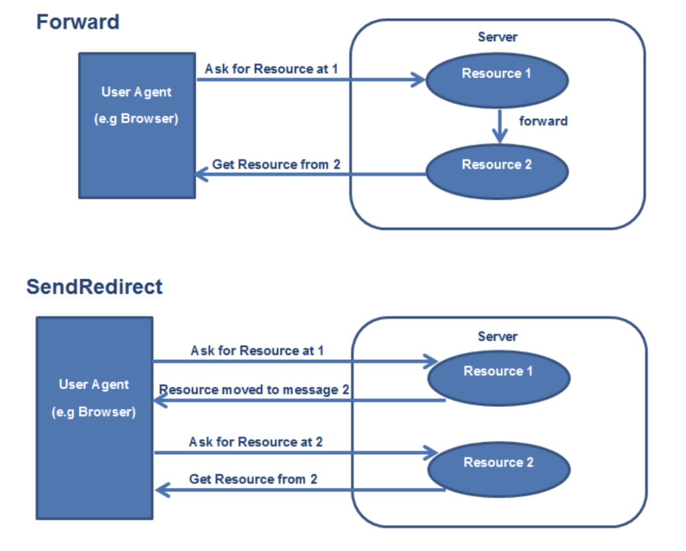
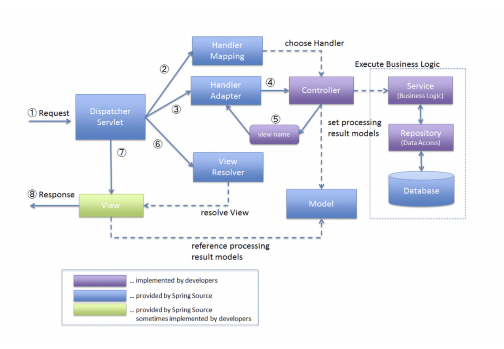

## MVC framework 만들기

### Forward / Redirect 차이
- Forward  
  • 서블릿에서 클라이언트(웹 브라우저)를 거치지 않고 바로 다른 서블릿(또는 JSP)에
  게 요청하는 방식  
  • Forward 방식은 서버 내부에서 일어나는 요청이기 때문에 HttpServletRequest,
  HttpServletResponse객체가 새롭게 생성되지 않음(공유됨)  
  • RequestDispatcher dispatcher = request.getRequestDispatcher("포워드 할
  서블릿 또는 JSP”)
  dispatcher.forward(request, response)

- Redirect  
  • 서블릿이 클라이언트(웹 브라우저)를 다시 거쳐 다른 서블릿(또는 JSP)에게 요청하
  는 방식  
  • Redirect 방식은 클라이언트로부터 새로운 요청이기 때문에 새로운
  HttpServletRequest, HttpServletResponse 객체가 생성됨  
  • HttpServletResponse객체의 sendRedirect( ) 이용

- MVC Framework

